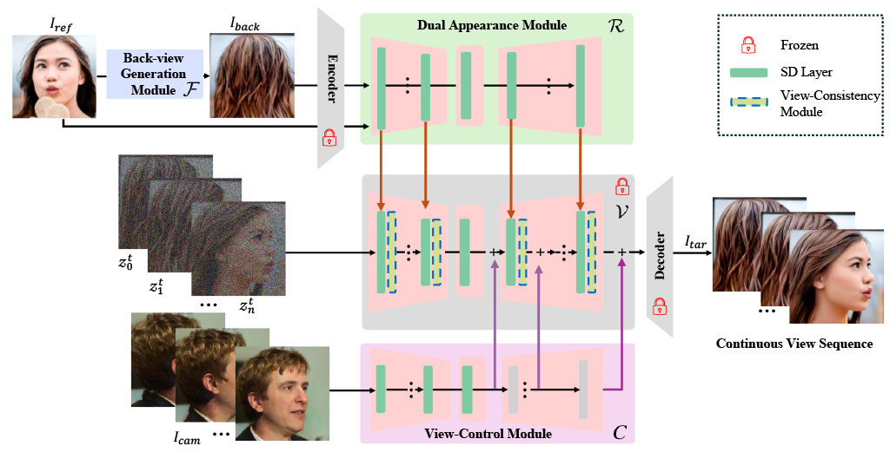

<p align="center">

  <h2 align="center">[CVPR"25]DiffPortrait360: Consistent Portrait Diffusion for 360 View Synthesis</h2>
  <p align="center">
      <a href="https://freedomgu.github.io/">Yuming Gu</a><sup>1,2</sup>
      ·
      <a href="https://p0lyfish.github.io/portfolio/">Phong Tran</a><sup>2</sup>
    ·  
      <a href="https://paulyzheng.github.io/about/">Yujian Zheng</a><sup>2</sup>
    ·  
      <a href="https://hongyixu37.github.io/homepage/">Hongyi Xu</a><sup>3</sup>
    ·  
      <a href="https://lhyfst.github.io/">Heyuan Li</a><sup>4</sup>
    ·  
      <a href="https://www.linkedin.com/in/adilbek-karmanov?originalSubdomain=ae">Adilbek Karmanov</a><sup>2</sup>
    ·  
      <a href="https://hao-li.com">Hao Li</a><sup>2,5</sup>
    <br>
    <sup>1</sup>Unviersity of Southern California &nbsp;<sup>2</sup>MBZUAI &nbsp; <sup>3</sup>ByteDance Inc. &nbsp; 
    <br>
    <sup>4</sup>The Chinese University of Hong Kong, Shenzhen&nbsp; <sup>5</sup>Pinscreen Inc.
    <br>
    </br>
        <a href="https://arxiv.org/abs/2503.15667">
        
        </a>
        <a href='https://freedomgu.github.io/DiffPortrait360/'>
        </a>
        <a href='https://huggingface.co/gym890/diffportrait360'>
        </a>
     </br>
</p>

## 📑 Open-source Plan
- [x] Project Page
- [x] Paper
- [ ] Inference code
- [ ] Checkpoints of Diffportrait360
- [ ] Checkpoints of Back-View Generation Module
- [ ] Interenet collected inference Data (self-collected from [Pexels](https://www.pexels.com/) which is used in [Diffportrait3D](https://github.com/FreedomGu/DiffPortrait3D))
- [ ] Gradio Demo

-----

This is the official pytorch implementation of Diffportrait360, which generates 360 degree human head through single image portrait.

## **Abstract**
Generating high-quality 360-degree views of human heads from single-view images is essential for enabling accessible immersive telepresence applications and scalable personalized content creation.
While cutting-edge methods for full head generation are limited to modeling realistic human heads, the latest diffusion-based approaches for style-omniscient head synthesis can produce only frontal views and struggle with view consistency, preventing their conversion into true 3D models for rendering from arbitrary angles.
We introduce a novel approach that generates fully consistent 360-degree head views, accommodating human, stylized, and anthropomorphic forms, including accessories like glasses and hats. Our method builds on the DiffPortrait3D framework, incorporating a custom ControlNet for back-of-head detail generation and a dual appearance module to ensure global front-back consistency. By training on continuous view sequences and integrating a back reference image, our approach achieves robust, locally continuous view synthesis. Our model can be used to produce high-quality neural radiance fields (NeRFs) for real-time, free-viewpoint rendering, outperforming state-of-the-art methods in object synthesis and 360-degree head generation for very challenging input portraits.

## **Architecture**

We employs a frozen pre-trained Latent Diffusion Model (LDM) as a rendering backbone and incorporates three auxiliary trainable modules for disentangled control of dual appearance R, camera control C, and U-Nets with view consistency {V}. Specifically, {R} extracts appearance information from {ref} and {back}}, and {C} derives the camera pose, which is rendered using an off-the-shelf 3D GAN. During training, we utilize a continuous sampling training strategy to better preserve the continuity of the camera trajectory. We enhance attention to continuity between frames to maintain the appearance information without changes due to turning angles. For inference, we employ our tailored back-view image generation network {F} to generate a back-view image, enabling us to generate a 360-degree full range of camera trajectories using a single image portrait. Note that $z$ stands for latent space noise rather than image. 

<p align="center">
  
</p>


## 📈 Results
### Comparison
To evaluate the dynamics texture generation performance of X-Dyna in human video animation, we compare the generation results of Diffportrait360 with PanoHead, SphereHead, Unique3D.
<table class="center">
<td><video src="./assets//Comparsion1.mp4" width="90%"></td>
</table>


### Ablation on Dual Appearance Module
<table align="center">
<td><video src="./assets//dual.mp4" width="90%"></td>
</table>


### Ablation on View Consistency

<table align="center">
<td><video src="./assets//Ablation_seq.mp4" width="90%"></td>
</table>


## 🎥 More Demos

<table align="center">
<td><video src="./assets//Teaser_video.mp4" width="90%"></td>
</table>


## 🔗 BibTeX
If you find [Diffportrait360](https://arxiv.org/abs/2501.10021) is useful for your research and applications, please cite Diffportrait360 using this BibTeX:

```BibTeX
@article{gu2025diffportrait360,
  title={DiffPortrait360: Consistent Portrait Diffusion for 360 View Synthesis},
  author={Gu, Yuming and Tran, Phong and Zheng, Yujian and Xu, Hongyi and Li, Heyuan and Karmanov, Adilbek and Li, Hao},
  journal={arXiv preprint arXiv:2503.15667},
  year={2025}
}
```


## License

Our code is distributed under the Apache-2.0 license.


## Acknowledgements

We appreciate the contributions from [Diffportrait360](https://github.com/FreedomGu/DiffPortrait3D), [PanoHead](https://github.com/SizheAn/PanoHead), [SphereHead](https://lhyfst.github.io/spherehead/), [ControlNet](https://github.com/lllyasviel/ControlNet) for their open-sourced research. We thank Egor Zakharov, Zhenhui Lin, Maksat Kengeskanov, and Yiming Chen for the early discussions, helpful suggestions, and feedback.


## IP Statement
Please contact yuminggu@usc.edu if there has been any misuse of images, and we will promptly remove them.

